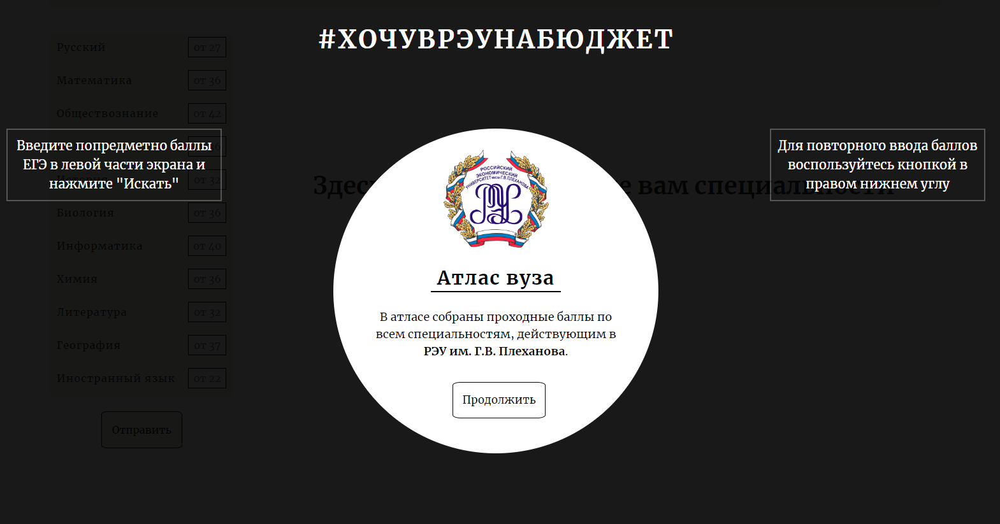
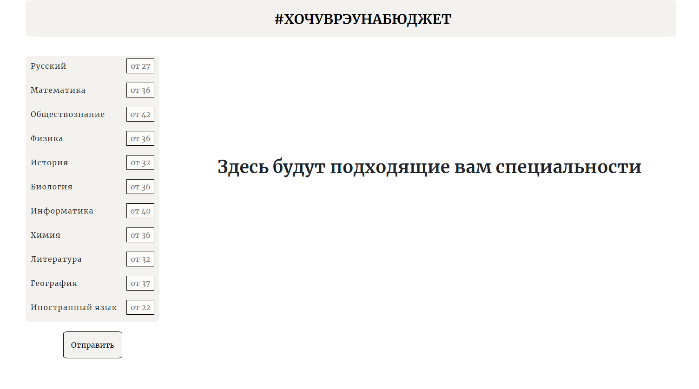
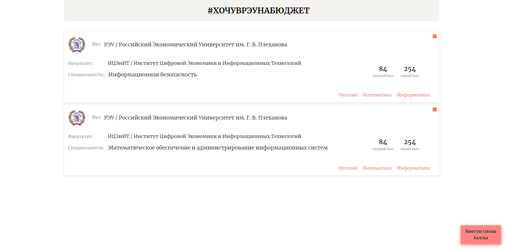
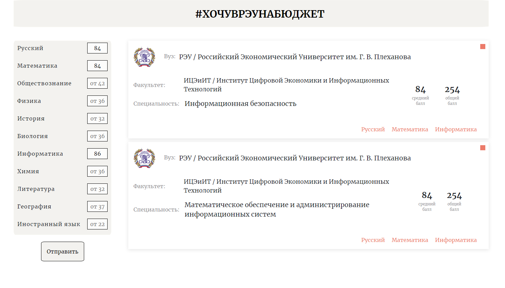

**free_REU** - сервис, помогающий абитуриентам, которые хотят поступить в РЭУ им. Г. В. Плеханова, выбрать специальность на основе баллов ЕГЭ (единый государственный экзамен).

**Стэк технологий:**
  - **Frontend:**
    - HTML / CSS
    - Native Js
    - HandleBars (template)

  - **Backend:**
    - NodeJs
    - Express
    - MySQL

## Using
- Запустив сервис, вы увидите стартовое окно с рекомендациями и описанием

- Нажав на кнопку "продолжить", Вы попадаете на главную страницу:

- Введя баллы ЕГЭ в левом окне вы получаете специальности, на бюджетные места которых Вы можете рассчитывать. Если вы ошиблись в вводе баллаов или хотите изменить запрос, воспользуйтесь кнопкой в право-нижнем углу

- При нажатии на кнопку "Ввести снова баллы" вы увидите перед собой следующее и сможете снова повторить ввод баллов

